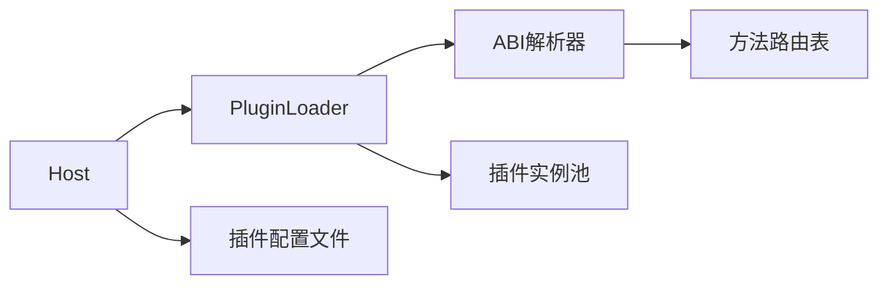

# 动态插件加载架构设计

## 1. 核心概念


## 2. 接口定义
```go
// 插件基础接口
type Plugin interface {
    GetABI() (ABI, error)
    Invoke(method string, args ...interface{}) (interface{}, error)
}

// ABI描述结构
type ABI struct {
    Name    string
    Version string
    Methods map[string]MethodSpec
}

// 方法规范
type MethodSpec struct {
    Params  []string
    Returns string
}
```

## 3. 实现步骤

### 3.1 插件端改造
1. 每个插件包含abi.json描述文件
2. 实现统一的Plugin接口
3. 通过反射暴露方法签名

### 3.2 宿主端改造
1. 插件扫描器：自动发现plugins目录
2. 动态加载器：根据ABI加载插件
3. 方法路由器：通过方法名调用插件

### 3.3 配置文件优化
```json
{
  "plugin_dir": "./plugins",
  "sandbox": {
    "memory_limit": "256MB",
    "timeout": "5s"
  }
}
```

## 4. 安全措施
1. 插件隔离沙箱
2. 输入参数验证
3. 资源使用限制