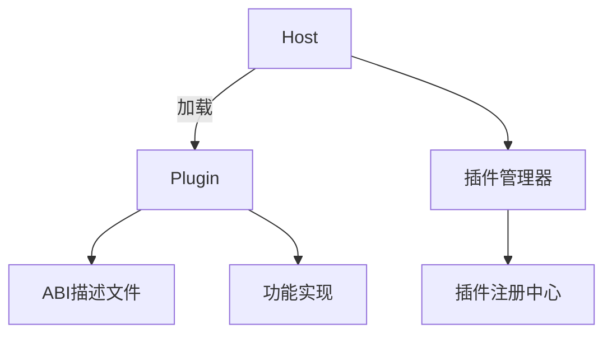

# 插件系统架构设计

## 1. 核心组件


## 2. ABI描述规范 (v1.0)
```json
{
  "name": "calculator",
  "version": "1.0.0",
  "exports": {
    "methods": {
      "Add": {
        "params": ["int", "int"],
        "returns": "int"
      },
      "Subtract": {
        "params": ["int", "int"],
        "returns": "int"
      }
    }
  }
}
```

## 3. 动态加载流程
1. 插件发现：扫描plugins目录
2. ABI验证：检查描述文件格式
3. 方法注册：建立方法路由表
4. 安全沙箱：隔离插件执行环境
5. 动态调用：通过反射调用插件方法

## 4. 接口定义
```go
type PluginABI struct {
    Name    string
    Version string
    Methods map[string]MethodDesc
}

type MethodDesc struct {
    Params []string
    Returns string
}
```

## 5. 后续步骤
1. 实现ABI加载器
2. 开发插件管理器
3. 创建方法路由系统